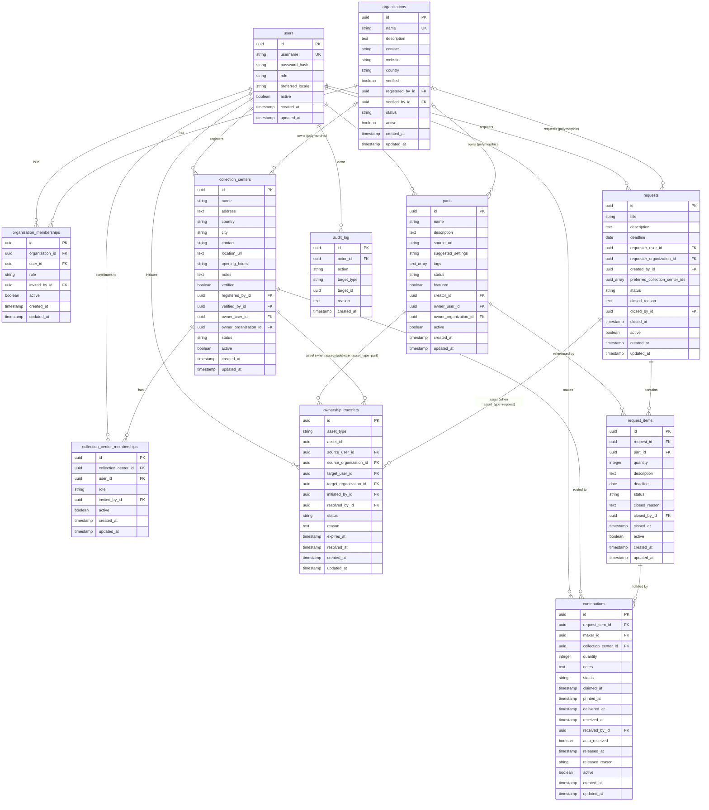
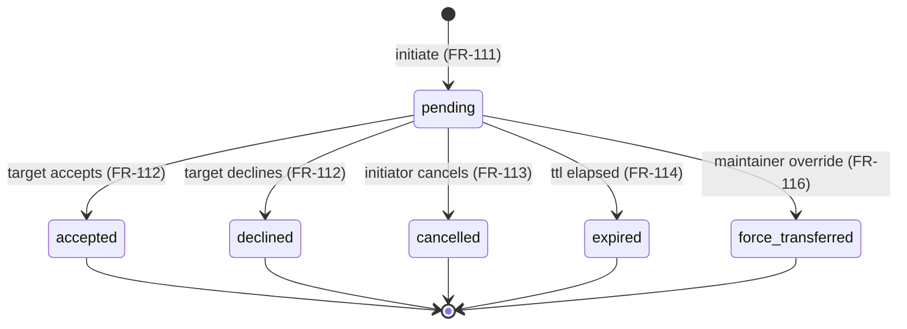

# Database Schema

PrintForHelp uses PostgreSQL for reliable coordination data with ACID
transactions and complex relationship queries. The schema encodes the
functional requirements specified in
[`requirements.md`](../requirements.md), including polymorphic
ownership of Parts and Collection Centers (FR-107), the membership
model that decentralizes Collection Center management (§3.4 / §3.9 of
the requirements), and the ownership transfer state machine (§3.10).

## Database Choice: PostgreSQL

- **ACID Compliance**: Essential for coordinated multi-actor workflows
  (ownership transfers, status transitions, audit logs)
- **Partial Unique Indexes**: Used heavily to enforce single-active
  invariants (one owner per org, one pending transfer per asset)
- **Array Types**: `UUID[]` and `TEXT[]` for preferred-centers and tags
- **CHECK Constraints**: Polymorphic ownership invariants enforced at
  the database level
- **JSONB Support**: Available for future extensibility (e.g., per-part
  accepted-by-center filters, FR-093)

## Schema Overview



## Global Types

Before creating tables we define custom ENUM types that ensure data
consistency across the schema. Some lifecycle states (e.g., audit
actions) are stored as `VARCHAR` with documented values rather than
`ENUM` to avoid `ALTER TYPE` migrations every time a new action is
added.

```sql
-- ===========================================
-- GLOBAL ENUMS
-- ===========================================

-- Application-wide user roles (FR-009)
CREATE TYPE user_role AS ENUM ('user', 'maintainer', 'admin');

-- UI locales the user can prefer (FR-006, NFR-015)
CREATE TYPE locale_code AS ENUM ('es', 'en');

-- Part lifecycle (FR-020)
CREATE TYPE part_status AS ENUM ('active', 'discontinued');

-- Collection Center operational status (FR-033)
CREATE TYPE collection_center_status AS ENUM ('active', 'inactive');

-- Organization operational status (FR-103)
CREATE TYPE organization_status AS ENUM ('active', 'inactive');

-- Membership roles
CREATE TYPE organization_role AS ENUM ('owner', 'member');     -- §6.9
CREATE TYPE collection_center_role AS ENUM ('contributor');    -- §6.7

-- Request lifecycle (FR-040)
CREATE TYPE request_status AS ENUM ('open', 'fulfilled', 'closed');

-- Contribution lifecycle (FR-052)
CREATE TYPE contribution_status AS ENUM (
  'claimed', 'printed', 'delivered', 'received', 'released'
);

-- Ownership transfer asset discriminator (§6.10 / FR-118)
CREATE TYPE ownership_transfer_asset_type AS ENUM (
  'part', 'collection_center', 'request'
);

-- Ownership transfer lifecycle (FR-111 – FR-116)
CREATE TYPE ownership_transfer_status AS ENUM (
  'pending', 'accepted', 'declined', 'cancelled', 'expired',
  'force_transferred'
);
```

### ENUM Reference

| Type | Values | FR Reference |
|------|--------|--------------|
| `user_role` | `user`, `maintainer`, `admin` | FR-009 |
| `locale_code` | `es`, `en` | FR-006 / NFR-015 |
| `part_status` | `active`, `discontinued` | FR-020 |
| `collection_center_status` | `active`, `inactive` | FR-033 |
| `shipment_status` | `receiving`, `closed`, `cancelled` | FR-128 |
| `organization_status` | `active`, `inactive` | FR-103 |
| `organization_role` | `owner`, `member` | §6.9 |
| `collection_center_role` | `contributor` | §6.7 |
| `request_status` | `open`, `fulfilled`, `closed` | FR-040 |
| `contribution_status` | `claimed`, `printed`, `delivered`, `received`, `released` | FR-052 |
| `ownership_transfer_asset_type` | `part`, `collection_center`, `request` | §6.10 / FR-118 |
| `ownership_transfer_status` | `pending`, `accepted`, `declined`, `cancelled`, `expired`, `force_transferred` | FR-111 – FR-116 |

`audit_log.action` and `audit_log.target_type` use `VARCHAR(64)` with
documented value sets (see §Audit Log below) rather than ENUMs, to
avoid schema migrations when a new auditable action is introduced. For
the same reason the polymorphic `activity_log.action` /
`activity_log.entity_type` and `comments.entity_type` columns use
`VARCHAR(40)`; their value sets are the `ActivityAction` / `EntityType`
enums in `app/activity/constants.py` (FR-131 – FR-133).

## Table Definitions

### Users

Primary user accounts. Soft-deletable. Default admin is bootstrapped
from env vars on first deploy (FR-007).

```sql
CREATE TABLE users (
    id UUID PRIMARY KEY DEFAULT gen_random_uuid(),
    username VARCHAR(64) UNIQUE NOT NULL,
    password_hash VARCHAR(255) NOT NULL,
    role user_role NOT NULL DEFAULT 'user',
    preferred_locale locale_code NOT NULL DEFAULT 'es',
    active BOOLEAN NOT NULL DEFAULT TRUE,
    created_at TIMESTAMP WITH TIME ZONE NOT NULL DEFAULT NOW(),
    updated_at TIMESTAMP WITH TIME ZONE NOT NULL DEFAULT NOW()
);

CREATE INDEX idx_users_username ON users(username);
CREATE INDEX idx_users_active ON users(active);
CREATE INDEX idx_users_role ON users(role);
```

### Organizations

Named groups that can own Parts and Collection Centers on behalf of
their members (§3.9).

```sql
CREATE TABLE organizations (
    id UUID PRIMARY KEY DEFAULT gen_random_uuid(),
    name VARCHAR(120) UNIQUE NOT NULL,
    description TEXT,
    contact VARCHAR(255) NOT NULL,
    website VARCHAR(500),
    country VARCHAR(80) NOT NULL,
    verified BOOLEAN NOT NULL DEFAULT FALSE,
    registered_by_id UUID NOT NULL REFERENCES users(id),
    verified_by_id UUID REFERENCES users(id),
    status organization_status NOT NULL DEFAULT 'active',
    active BOOLEAN NOT NULL DEFAULT TRUE,
    created_at TIMESTAMP WITH TIME ZONE NOT NULL DEFAULT NOW(),
    updated_at TIMESTAMP WITH TIME ZONE NOT NULL DEFAULT NOW(),

    CONSTRAINT verified_implies_verifier
      CHECK ((verified = FALSE) OR (verified_by_id IS NOT NULL))
);

CREATE INDEX idx_organizations_name ON organizations(name);
CREATE INDEX idx_organizations_country ON organizations(country);
CREATE INDEX idx_organizations_verified ON organizations(verified);
CREATE INDEX idx_organizations_status ON organizations(status);
CREATE INDEX idx_organizations_active ON organizations(active);
```

### Organization Memberships

Links users to organizations with a role of `owner` or `member`
(§6.9). Exactly one active `owner` per active organization is enforced
via a partial unique index (FR-100).

```sql
CREATE TABLE organization_memberships (
    id UUID PRIMARY KEY DEFAULT gen_random_uuid(),
    organization_id UUID NOT NULL
      REFERENCES organizations(id) ON DELETE CASCADE,
    user_id UUID NOT NULL REFERENCES users(id) ON DELETE CASCADE,
    role organization_role NOT NULL,
    invited_by_id UUID REFERENCES users(id),
    active BOOLEAN NOT NULL DEFAULT TRUE,
    created_at TIMESTAMP WITH TIME ZONE NOT NULL DEFAULT NOW(),
    updated_at TIMESTAMP WITH TIME ZONE NOT NULL DEFAULT NOW()
);

-- A user cannot have two simultaneous active memberships on the same
-- organization (FR-099 / FR-100).
CREATE UNIQUE INDEX uniq_org_membership_active
  ON organization_memberships(organization_id, user_id)
  WHERE active = TRUE;

-- Exactly one active owner per active organization (FR-100).
CREATE UNIQUE INDEX uniq_org_owner_active
  ON organization_memberships(organization_id)
  WHERE active = TRUE AND role = 'owner';

CREATE INDEX idx_org_membership_user ON organization_memberships(user_id);
CREATE INDEX idx_org_membership_org ON organization_memberships(organization_id);
```

### Parts

The community catalog of printable designs. Polymorphic ownership
(FR-107): exactly one of `owner_user_id` / `owner_organization_id` is
non-null at any time. `creator_id` is immutable historical attribution
(FR-016).

```sql
CREATE TABLE parts (
    id UUID PRIMARY KEY DEFAULT gen_random_uuid(),
    name VARCHAR(200) NOT NULL,
    description TEXT,
    source_url VARCHAR(500) NOT NULL,
    suggested_settings TEXT,
    tags TEXT[] NOT NULL DEFAULT '{}',
    status part_status NOT NULL DEFAULT 'active',
    featured BOOLEAN NOT NULL DEFAULT FALSE,
    creator_id UUID NOT NULL REFERENCES users(id),
    owner_user_id UUID REFERENCES users(id),
    owner_organization_id UUID REFERENCES organizations(id),
    active BOOLEAN NOT NULL DEFAULT TRUE,
    created_at TIMESTAMP WITH TIME ZONE NOT NULL DEFAULT NOW(),
    updated_at TIMESTAMP WITH TIME ZONE NOT NULL DEFAULT NOW(),

    -- Polymorphic ownership invariant (FR-107)
    CONSTRAINT parts_one_owner CHECK (
      (owner_user_id IS NOT NULL AND owner_organization_id IS NULL) OR
      (owner_user_id IS NULL AND owner_organization_id IS NOT NULL)
    )
);

CREATE INDEX idx_parts_status ON parts(status);
CREATE INDEX idx_parts_featured ON parts(featured);
CREATE INDEX idx_parts_active ON parts(active);
CREATE INDEX idx_parts_creator ON parts(creator_id);
CREATE INDEX idx_parts_owner_user ON parts(owner_user_id);
CREATE INDEX idx_parts_owner_org ON parts(owner_organization_id);
CREATE INDEX idx_parts_tags ON parts USING GIN (tags);
CREATE INDEX idx_parts_name_trgm
  ON parts USING GIN (name gin_trgm_ops);   -- for free-text search (FR-021)
```

### Collection Centers

Physical drop-off locations for printed parts. Polymorphic ownership
mirrors Parts. Public visibility is gated on `verified = TRUE`
(FR-027).

```sql
CREATE TABLE collection_centers (
    id UUID PRIMARY KEY DEFAULT gen_random_uuid(),
    name VARCHAR(200) NOT NULL,
    address TEXT NOT NULL,
    country VARCHAR(80) NOT NULL,
    city VARCHAR(120) NOT NULL,
    contact VARCHAR(255) NOT NULL,
    location_url TEXT,
    opening_hours TEXT,
    notes TEXT,
    verified BOOLEAN NOT NULL DEFAULT FALSE,
    registered_by_id UUID NOT NULL REFERENCES users(id),
    verified_by_id UUID REFERENCES users(id),
    owner_user_id UUID REFERENCES users(id),
    owner_organization_id UUID REFERENCES organizations(id),
    status collection_center_status NOT NULL DEFAULT 'active',
    active BOOLEAN NOT NULL DEFAULT TRUE,
    created_at TIMESTAMP WITH TIME ZONE NOT NULL DEFAULT NOW(),
    updated_at TIMESTAMP WITH TIME ZONE NOT NULL DEFAULT NOW(),

    -- Polymorphic ownership invariant (FR-083 / FR-107)
    CONSTRAINT cc_one_owner CHECK (
      (owner_user_id IS NOT NULL AND owner_organization_id IS NULL) OR
      (owner_user_id IS NULL AND owner_organization_id IS NOT NULL)
    ),

    CONSTRAINT cc_verified_implies_verifier
      CHECK ((verified = FALSE) OR (verified_by_id IS NOT NULL))
);

CREATE INDEX idx_cc_verified ON collection_centers(verified);
CREATE INDEX idx_cc_status ON collection_centers(status);
CREATE INDEX idx_cc_active ON collection_centers(active);
CREATE INDEX idx_cc_country_city ON collection_centers(country, city);
CREATE INDEX idx_cc_owner_user ON collection_centers(owner_user_id);
CREATE INDEX idx_cc_owner_org ON collection_centers(owner_organization_id);
```

### Collection Center Memberships

Per-center **contributors only** (the owner lives on the Collection
Center entity itself, §6.7). The role enum currently has a single
value but stays as an enum for forward extensibility.

```sql
CREATE TABLE collection_center_memberships (
    id UUID PRIMARY KEY DEFAULT gen_random_uuid(),
    collection_center_id UUID NOT NULL
      REFERENCES collection_centers(id) ON DELETE CASCADE,
    user_id UUID NOT NULL REFERENCES users(id) ON DELETE CASCADE,
    role collection_center_role NOT NULL DEFAULT 'contributor',
    invited_by_id UUID NOT NULL REFERENCES users(id),
    active BOOLEAN NOT NULL DEFAULT TRUE,
    created_at TIMESTAMP WITH TIME ZONE NOT NULL DEFAULT NOW(),
    updated_at TIMESTAMP WITH TIME ZONE NOT NULL DEFAULT NOW()
);

-- A user cannot have two simultaneous contributor memberships on the
-- same Collection Center.
CREATE UNIQUE INDEX uniq_cc_membership_active
  ON collection_center_memberships(collection_center_id, user_id)
  WHERE active = TRUE;

CREATE INDEX idx_cc_membership_user ON collection_center_memberships(user_id);
CREATE INDEX idx_cc_membership_cc ON collection_center_memberships(collection_center_id);
```

### Shipments

A planned dispatch of collected aid from a Collection Center to where it
is needed (FR-127 – FR-130). Always publicly readable; managed by the
center's effective members and maintainers/admins.

```sql
CREATE TABLE shipments (
    id UUID PRIMARY KEY DEFAULT gen_random_uuid(),
    collection_center_id UUID NOT NULL
      REFERENCES collection_centers(id) ON DELETE CASCADE,
    shipment_date DATE NOT NULL,
    status shipment_status NOT NULL DEFAULT 'receiving',
    destination VARCHAR(255),
    description TEXT,
    created_by_id UUID NOT NULL REFERENCES users(id),
    active BOOLEAN NOT NULL DEFAULT TRUE,
    created_at TIMESTAMP WITH TIME ZONE NOT NULL DEFAULT NOW(),
    updated_at TIMESTAMP WITH TIME ZONE NOT NULL DEFAULT NOW()
);

CREATE INDEX ix_shipments_cc ON shipments(collection_center_id);
CREATE INDEX ix_shipments_date ON shipments(shipment_date);
CREATE INDEX ix_shipments_status ON shipments(status);
```

### Comments

Polymorphic, user-authored Markdown comments (FR-131 – FR-132). The
`(entity_type, entity_id)` pair points at the target without a foreign
key, so the same table serves any commentable domain (currently
Collection Centers and Shipments). Publicly readable.

```sql
CREATE TABLE comments (
    id UUID PRIMARY KEY DEFAULT gen_random_uuid(),
    entity_type VARCHAR(40) NOT NULL,
    entity_id UUID NOT NULL,
    author_user_id UUID NOT NULL REFERENCES users(id),
    body TEXT NOT NULL,
    edited_at TIMESTAMP WITH TIME ZONE,
    active BOOLEAN NOT NULL DEFAULT TRUE,
    created_at TIMESTAMP WITH TIME ZONE NOT NULL DEFAULT NOW(),
    updated_at TIMESTAMP WITH TIME ZONE NOT NULL DEFAULT NOW()
);

CREATE INDEX ix_comments_entity_created
  ON comments(entity_type, entity_id, created_at);
```

### Activity Log

The **public** append-only timeline of lifecycle and comment events
(FR-133). Polymorphic like `comments`. Distinct from the private
moderation `audit_log` (§Audit Log) — this one is meant to be shown to
the community.

```sql
CREATE TABLE activity_log (
    id UUID PRIMARY KEY DEFAULT gen_random_uuid(),
    entity_type VARCHAR(40) NOT NULL,
    entity_id UUID NOT NULL,
    actor_user_id UUID NOT NULL REFERENCES users(id),
    action VARCHAR(40) NOT NULL,
    changes JSONB NOT NULL DEFAULT '{}'::jsonb,
    active BOOLEAN NOT NULL DEFAULT TRUE,
    created_at TIMESTAMP WITH TIME ZONE NOT NULL DEFAULT NOW(),
    updated_at TIMESTAMP WITH TIME ZONE NOT NULL DEFAULT NOW()
);

CREATE INDEX ix_activity_log_entity_created
  ON activity_log(entity_type, entity_id, created_at);
```

### Requests

A campaign-level container (FR-038). Each Request bundles one or more
`request_items` rows; the per-Part target quantities live on the
items (§3.5). Ownership is polymorphic — either `requester_user_id`
or `requester_organization_id` is non-null (FR-039 / FR-107), and the
asset is transferrable through the OwnershipTransfer flow (FR-118).
`preferred_collection_center_ids` is a UUID array — a hint to makers
about preferred drop-off points; an empty array means "any verified
Center is fine."

```sql
CREATE TABLE requests (
    id UUID PRIMARY KEY DEFAULT gen_random_uuid(),
    title VARCHAR(200) NOT NULL,
    description TEXT,
    deadline DATE,
    requester_user_id UUID REFERENCES users(id),
    requester_organization_id UUID REFERENCES organizations(id),
    created_by_id UUID NOT NULL REFERENCES users(id),
    preferred_collection_center_ids UUID[] NOT NULL DEFAULT '{}',
    status request_status NOT NULL DEFAULT 'open',
    closed_reason TEXT,
    closed_by_id UUID REFERENCES users(id),
    closed_at TIMESTAMP WITH TIME ZONE,
    active BOOLEAN NOT NULL DEFAULT TRUE,
    created_at TIMESTAMP WITH TIME ZONE NOT NULL DEFAULT NOW(),
    updated_at TIMESTAMP WITH TIME ZONE NOT NULL DEFAULT NOW(),

    -- Polymorphic requester invariant (FR-039 / FR-107)
    CONSTRAINT requests_one_requester CHECK (
      (requester_user_id IS NOT NULL AND requester_organization_id IS NULL) OR
      (requester_user_id IS NULL AND requester_organization_id IS NOT NULL)
    ),

    -- closed_at must be set iff status is closed or fulfilled
    CONSTRAINT request_closed_consistency CHECK (
      (status = 'open' AND closed_at IS NULL) OR
      (status IN ('fulfilled', 'closed') AND closed_at IS NOT NULL)
    )
);

CREATE INDEX idx_requests_requester_user ON requests(requester_user_id);
CREATE INDEX idx_requests_requester_org ON requests(requester_organization_id);
CREATE INDEX idx_requests_status ON requests(status);
CREATE INDEX idx_requests_deadline ON requests(deadline);
CREATE INDEX idx_requests_active ON requests(active);
CREATE INDEX idx_requests_preferred_cc
  ON requests USING GIN (preferred_collection_center_ids);
```

> **Note**: We use a `UUID[]` column for `preferred_collection_center_ids`
> to match the requirements doc and keep reads simple (a Request always
> ships with its full preferred-center list). If the relationship grows
> richer (per-Center notes, weighting, etc.) we will refactor to a join
> table `request_preferred_centers(request_id, collection_center_id, …)`.

### Request Items

A single line within a Request (FR-119 – FR-124): one Part with its
own target quantity and lifecycle. Contributions reference items, not
the parent Request.

```sql
CREATE TABLE request_items (
    id UUID PRIMARY KEY DEFAULT gen_random_uuid(),
    request_id UUID NOT NULL
      REFERENCES requests(id) ON DELETE CASCADE,
    part_id UUID NOT NULL REFERENCES parts(id),
    quantity INTEGER CHECK (quantity IS NULL OR quantity > 0),
    description TEXT,
    deadline DATE,
    status request_status NOT NULL DEFAULT 'open',
    closed_reason TEXT,
    closed_by_id UUID REFERENCES users(id),
    closed_at TIMESTAMP WITH TIME ZONE,
    active BOOLEAN NOT NULL DEFAULT TRUE,
    created_at TIMESTAMP WITH TIME ZONE NOT NULL DEFAULT NOW(),
    updated_at TIMESTAMP WITH TIME ZONE NOT NULL DEFAULT NOW(),

    CONSTRAINT request_item_closed_consistency CHECK (
      (status = 'open' AND closed_at IS NULL) OR
      (status IN ('fulfilled', 'closed') AND closed_at IS NOT NULL)
    )
);

CREATE INDEX idx_request_items_request ON request_items(request_id);
CREATE INDEX idx_request_items_part ON request_items(part_id);
CREATE INDEX idx_request_items_status ON request_items(status);
CREATE INDEX idx_request_items_deadline ON request_items(deadline);
CREATE INDEX idx_request_items_active ON request_items(active);

-- Fast lookup: "open items by Part" (catalog-side counter in FR-022)
CREATE INDEX idx_request_items_open_by_part
  ON request_items(part_id)
  WHERE status = 'open' AND active = TRUE;
```

> **Invariant** (enforced in the service layer, not in SQL):
> every active Request must have at least one active RequestItem
> (FR-119). The service rejects removal of the last item; it does
> not enforce this via a deferred constraint to keep inserts simple.

### Contributions

A maker's commitment to print a quantity of one RequestItem and
deliver it to a Centro (FR-050). The five-state lifecycle is enforced
in the service layer; per-state timestamps record when each transition
happened (FR-058). When the maker is also an effective member of the
target Centro, `delivered → received` happens automatically in the
same transaction (FR-126), and `auto_received` is set to `TRUE`.

```sql
CREATE TABLE contributions (
    id UUID PRIMARY KEY DEFAULT gen_random_uuid(),
    request_item_id UUID NOT NULL REFERENCES request_items(id),
    maker_id UUID NOT NULL REFERENCES users(id),
    collection_center_id UUID NOT NULL
      REFERENCES collection_centers(id),
    quantity INTEGER NOT NULL CHECK (quantity > 0),
    notes TEXT,
    status contribution_status NOT NULL DEFAULT 'claimed',
    claimed_at TIMESTAMP WITH TIME ZONE NOT NULL DEFAULT NOW(),
    printed_at TIMESTAMP WITH TIME ZONE,
    delivered_at TIMESTAMP WITH TIME ZONE,
    received_at TIMESTAMP WITH TIME ZONE,
    received_by_id UUID REFERENCES users(id),
    auto_received BOOLEAN NOT NULL DEFAULT FALSE,
    released_at TIMESTAMP WITH TIME ZONE,
    released_reason VARCHAR(64),  -- 'manual', 'expired',
                                  -- 'collection_center_archived',
                                  -- 'request_closed',
                                  -- 'request_item_closed'
    active BOOLEAN NOT NULL DEFAULT TRUE,
    created_at TIMESTAMP WITH TIME ZONE NOT NULL DEFAULT NOW(),
    updated_at TIMESTAMP WITH TIME ZONE NOT NULL DEFAULT NOW(),

    -- received transitions require a receiver (FR-056)
    CONSTRAINT received_has_receiver CHECK (
      (status != 'received' AND status != 'delivered'
         AND received_by_id IS NULL)
      OR status IN ('received', 'delivered')
    )
);

CREATE INDEX idx_contributions_request_item ON contributions(request_item_id);
CREATE INDEX idx_contributions_maker ON contributions(maker_id);
CREATE INDEX idx_contributions_cc ON contributions(collection_center_id);
CREATE INDEX idx_contributions_status ON contributions(status);
CREATE INDEX idx_contributions_active ON contributions(active);

-- Fast lookups for FR-035 (delivered awaiting confirmation by centro)
CREATE INDEX idx_contributions_delivered_by_cc
  ON contributions(collection_center_id)
  WHERE status = 'delivered';

-- Fast lookups for FR-055 (auto-expire stale claims)
CREATE INDEX idx_contributions_stale_claims
  ON contributions(claimed_at)
  WHERE status = 'claimed';
```

### Ownership Transfers

A pending or resolved transfer of a Part or Collection Center to a
new principal (User or Organization). Polymorphic on both source and
target. `asset_id` is **not** a real foreign key because it resolves
to a different table depending on `asset_type`; integrity is enforced
in the service layer (§3.10, FR-111 – FR-116).

```sql
CREATE TABLE ownership_transfers (
    id UUID PRIMARY KEY DEFAULT gen_random_uuid(),
    asset_type ownership_transfer_asset_type NOT NULL,
    asset_id UUID NOT NULL,
    source_user_id UUID REFERENCES users(id),
    source_organization_id UUID REFERENCES organizations(id),
    target_user_id UUID REFERENCES users(id),
    target_organization_id UUID REFERENCES organizations(id),
    initiated_by_id UUID NOT NULL REFERENCES users(id),
    resolved_by_id UUID REFERENCES users(id),
    status ownership_transfer_status NOT NULL DEFAULT 'pending',
    reason TEXT,
    expires_at TIMESTAMP WITH TIME ZONE NOT NULL,
    resolved_at TIMESTAMP WITH TIME ZONE,
    created_at TIMESTAMP WITH TIME ZONE NOT NULL DEFAULT NOW(),
    updated_at TIMESTAMP WITH TIME ZONE NOT NULL DEFAULT NOW(),

    -- Exactly one source principal
    CONSTRAINT transfer_one_source CHECK (
      (source_user_id IS NOT NULL AND source_organization_id IS NULL) OR
      (source_user_id IS NULL AND source_organization_id IS NOT NULL)
    ),
    -- Exactly one target principal
    CONSTRAINT transfer_one_target CHECK (
      (target_user_id IS NOT NULL AND target_organization_id IS NULL) OR
      (target_user_id IS NULL AND target_organization_id IS NOT NULL)
    ),
    -- Terminal statuses must have resolved_at set
    CONSTRAINT transfer_terminal_resolved CHECK (
      (status = 'pending' AND resolved_at IS NULL) OR
      (status != 'pending' AND resolved_at IS NOT NULL)
    )
);

-- At most one pending transfer per asset (FR-115)
CREATE UNIQUE INDEX uniq_pending_transfer_per_asset
  ON ownership_transfers(asset_type, asset_id)
  WHERE status = 'pending';

CREATE INDEX idx_transfers_asset ON ownership_transfers(asset_type, asset_id);
CREATE INDEX idx_transfers_source_user ON ownership_transfers(source_user_id);
CREATE INDEX idx_transfers_source_org ON ownership_transfers(source_organization_id);
CREATE INDEX idx_transfers_target_user ON ownership_transfers(target_user_id);
CREATE INDEX idx_transfers_target_org ON ownership_transfers(target_organization_id);
CREATE INDEX idx_transfers_status ON ownership_transfers(status);
CREATE INDEX idx_transfers_expires ON ownership_transfers(expires_at)
  WHERE status = 'pending';
```

### Audit Log

Append-only audit trail for moderator-relevant and trust-relevant
actions (NFR-008). `action` and `target_type` are `VARCHAR(64)` with
documented value sets, not ENUMs, so adding a new auditable action
does not require a schema migration.

```sql
CREATE TABLE audit_log (
    id UUID PRIMARY KEY DEFAULT gen_random_uuid(),
    actor_id UUID NOT NULL REFERENCES users(id),
    action VARCHAR(64) NOT NULL,
    target_type VARCHAR(64) NOT NULL,
    target_id UUID NOT NULL,
    reason TEXT,
    created_at TIMESTAMP WITH TIME ZONE NOT NULL DEFAULT NOW()
);

CREATE INDEX idx_audit_actor_created ON audit_log(actor_id, created_at DESC);
CREATE INDEX idx_audit_target_created
  ON audit_log(target_type, target_id, created_at DESC);
CREATE INDEX idx_audit_action_created ON audit_log(action, created_at DESC);
```

#### Documented `action` values

Grouped by domain (matching §6.6 of the requirements doc):

| Domain | Actions |
|---|---|
| **Roles & users** | `change_role`, `deactivate_user`, `reactivate_user` |
| **Parts** | `force_archive_part` |
| **Collection Centers** | `verify_collection_center`, `revoke_collection_center`, `force_archive_collection_center`, `add_contributor`, `remove_contributor` |
| **Requests** | `override_close_request`, `override_close_request_item` |
| **Contributions** | `confirm_received`, `auto_receive_contribution` |
| **Organizations** | `verify_organization`, `revoke_organization_verification`, `org_add_member`, `org_remove_member`, `org_transfer_ownership`, `force_transfer_org_ownership` |
| **Ownership transfers** | `initiate_ownership_transfer`, `accept_ownership_transfer`, `decline_ownership_transfer`, `cancel_ownership_transfer`, `expire_ownership_transfer`, `force_transfer_ownership` |

#### Documented `target_type` values

`User`, `Part`, `CollectionCenter`, `CollectionCenterMembership`,
`Request`, `RequestItem`, `Contribution`, `Organization`,
`OrganizationMembership`, `OwnershipTransfer`.

## Relationship Details

### User → Organization Memberships (M:N via `organization_memberships`)

A user can be a member of any number of organizations; each org has
one owner plus zero or more members (FR-094 – FR-101). Memberships are
soft-deletable so a former member's historical attribution survives.

### User → Collection Center Memberships (M:N via `collection_center_memberships`)

A user can be a per-center contributor on any number of Collection
Centers (FR-081). Owners of Centers are stored on the Center entity,
not in this table.

### Polymorphic Owner: User OR Organization

Parts and Collection Centers each have two nullable owner FKs —
`owner_user_id` and `owner_organization_id` — with a `CHECK` that
exactly one is non-null. This pattern is repeated for the source and
target principals on `ownership_transfers`. The "Polymorphic
Ownership Pattern" section below covers the rationale and access
patterns.

### Request → Request Items → Part (1:N → N:1)

A Request bundles many RequestItems (FR-119); each item references
exactly one Part. A single Part can therefore be referenced by many
RequestItems across many Requests. When a Part is force-archived
(FR-077), every RequestItem referencing it gets transitioned to
`closed` with reason `part_archived` in the same transaction; if all
items on a Request close, the Request auto-fulfills/auto-closes per
FR-041 / FR-049.

### Request Item → Contributions (1:N)

Each RequestItem can have many Contributions in different lifecycle
states; each Contribution belongs to exactly one item. The item's
"remaining quantity" (FR-121) is computed live from active
Contributions — see [Sample Queries](#sample-queries) below — never
denormalized (FR-070). The parent Request rolls up its items'
progress (FR-045).

### Collection Center → Contributions (1:N)

Contributions route to exactly one target Centro. When a Centro is
force-archived (FR-080), all open Contributions routed to it are
auto-released with reason `collection_center_archived`. When the
maker happens to be an effective member of the target Centro,
`delivered → received` happens automatically (FR-126).

### Ownership Transfer → Asset (polymorphic)

`asset_id` references a Part, a Collection Center, or a Request,
decided by `asset_type` (FR-118). There is no DB-level foreign key
(PostgreSQL does not support a single column referencing multiple
tables). Service code must validate the reference on insert and on
`accept`.

## Polymorphic Ownership Pattern

This section is the analog of Colony's "Recurrence Configuration
Schema" — the one domain-specific construct that needs deep
explanation because it shapes the entire access control model.

### The Two-FK + CHECK Pattern

Both `parts` and `collection_centers` have:

```sql
owner_user_id         UUID REFERENCES users(id),
owner_organization_id UUID REFERENCES organizations(id),
CONSTRAINT one_owner CHECK (
  (owner_user_id IS NOT NULL AND owner_organization_id IS NULL) OR
  (owner_user_id IS NULL AND owner_organization_id IS NOT NULL)
)
```

This pattern was chosen over the alternatives:

| Alternative | Why we rejected it |
|---|---|
| Single `owner_id` + `owner_type` (Rails STI style) | No FK constraint possible — cannot guarantee referential integrity at the DB level |
| One join table per (asset, principal-type) | Doubles the number of tables and makes "who owns this Part?" a UNION query |
| Single `owners` table referenced by both Users and Organizations | Requires a third entity that has no real meaning; complicates joins |

The two-FK approach preserves DB-level referential integrity (PG
checks on every write that the FK exists), keeps reads to a single
table scan, and the `CHECK` enforces the "exactly one" invariant.

### Effective Owner

For any owner-power FR (e.g., FR-079: only the owner can archive a
Centro), the "effective owner" is a set of users defined by:

```python
# backend/app/{parts,collection_centers}/service.py — sketch
def effective_owner_user_ids(db: Session, asset) -> set[UUID]:
    """Return the set of users with owner-equivalent powers on this asset."""
    if asset.owner_user_id is not None:
        return {asset.owner_user_id}
    # Org-owned: all active org owners
    rows = db.query(OrganizationMembership.user_id).filter(
        OrganizationMembership.organization_id == asset.owner_organization_id,
        OrganizationMembership.role == "owner",
        OrganizationMembership.active.is_(True),
    ).all()
    return {row.user_id for row in rows}
```

A user can act with owner powers on an asset iff they are in this
set, OR they hold a global `maintainer` / `admin` role (NFR-006).

### Effective Members (Collection Centers only)

Member-equivalent powers (edit, toggle status, confirm received —
FR-031, FR-056, FR-078) extend further: per-center contributors plus
all members of the owning organization if org-owned.

```python
# backend/app/collection_centers/service.py — sketch
def effective_member_user_ids(db: Session, cc) -> set[UUID]:
    """Return the set of users with member-equivalent powers on this CC."""
    member_ids: set[UUID] = set()

    # 1. Per-center contributors (always applicable)
    rows = db.query(CollectionCenterMembership.user_id).filter(
        CollectionCenterMembership.collection_center_id == cc.id,
        CollectionCenterMembership.active.is_(True),
    ).all()
    member_ids.update(r.user_id for r in rows)

    # 2. Owner principal contributes to member powers too
    if cc.owner_user_id is not None:
        member_ids.add(cc.owner_user_id)
    else:
        # All active members (any role) of the owning org
        rows = db.query(OrganizationMembership.user_id).filter(
            OrganizationMembership.organization_id ==
              cc.owner_organization_id,
            OrganizationMembership.active.is_(True),
        ).all()
        member_ids.update(r.user_id for r in rows)

    return member_ids
```

### Resolving Ownership in SQL

The "effective owner users" of an asset, joined to a single query:

```sql
-- Effective owner users for a single Part (or CC).
SELECT user_id
FROM (
  -- Direct user-owner
  SELECT p.owner_user_id AS user_id
  FROM parts p
  WHERE p.id = $1 AND p.owner_user_id IS NOT NULL
  UNION ALL
  -- Indirect: org owners of the owning org
  SELECT om.user_id
  FROM parts p
  JOIN organization_memberships om
    ON om.organization_id = p.owner_organization_id
   AND om.role = 'owner'
   AND om.active = TRUE
  WHERE p.id = $1
) owners
WHERE user_id IS NOT NULL;
```

This pattern is used by the authorization layer on every protected
endpoint.

## Ownership Transfer Lifecycle



- **pending** is the only mutable state. All terminal states are
  immutable.
- The partial unique index `uniq_pending_transfer_per_asset` enforces
  FR-115 — only one pending transfer per `(asset_type, asset_id)` at
  a time.
- A scheduled job (Celery/APScheduler — TBD) flips `pending` rows
  whose `expires_at` has passed to `expired` and writes an
  `expire_ownership_transfer` audit row.
- On `accepted` and `force_transferred`, the asset's
  `owner_user_id` / `owner_organization_id` columns are swapped to the
  target principal in the **same transaction** as the status update,
  preserving the invariant of "every asset has exactly one owner at
  all times" (FR-107, NFR-014).

### Transaction Sketch — Accepting a Transfer

```python
# backend/app/ownership_transfers/service.py — sketch
def accept_transfer(db: Session, transfer: OwnershipTransfer,
                    acceptor: User) -> None:
    """Atomically swap ownership and resolve the transfer (FR-112)."""
    asset = _load_asset(db, transfer.asset_type, transfer.asset_id)

    # Apply new ownership
    asset.owner_user_id = transfer.target_user_id
    asset.owner_organization_id = transfer.target_organization_id

    # Resolve the transfer
    transfer.status = OwnershipTransferStatus.accepted
    transfer.resolved_by_id = acceptor.id
    transfer.resolved_at = datetime.now(tz=UTC)

    # Audit
    db.add(AuditLog(
        actor_id=acceptor.id,
        action="accept_ownership_transfer",
        target_type="OwnershipTransfer",
        target_id=transfer.id,
    ))
    db.commit()
    db.refresh(asset)
```

The CHECK constraint on the asset (`one_owner`) guarantees that the
new owner fields are well-formed before the transaction commits.

## Key Design Decisions

### 1. Polymorphic Ownership via Two FK Columns

See the [Polymorphic Ownership Pattern](#polymorphic-ownership-pattern)
section. Preserves referential integrity, keeps reads cheap, and the
"exactly one" invariant is enforced at the DB level.

### 2. Owner Lives on the Entity; Membership Table Is Contributors Only

For Collection Centers, we deliberately do not represent the owner as
a row in `collection_center_memberships`. The owner is on the Centro
row itself (one of two FKs). This keeps:

- Membership rows pure (a contributor is always a contributor)
- Ownership transfers atomic (one row write, not a delete + insert)
- The "exactly one owner" invariant enforced by `CHECK` instead of a
  partial unique index on the membership table

### 3. Audit Log Uses VARCHAR Action / Target, Not ENUMs

`audit_log.action` and `audit_log.target_type` are `VARCHAR(64)`
rather than enums so new auditable actions can be introduced without
an `ALTER TYPE` migration. The trade-off is no enforcement of valid
values at the DB level; the service layer is the source of truth.
This is the same trade-off Colony made for `activity_log`.

### 4. Partial Unique Indexes Enforce Single-Active Invariants

PostgreSQL partial unique indexes are the cleanest way to express
invariants like "exactly one active owner per org" (FR-100) and "at
most one pending transfer per asset" (FR-115). They are constant-time
and enforced by the DB on every write.

### 5. UUID[] for `preferred_collection_center_ids` (For Now)

We keep the array column to match the requirements doc and to keep
read paths simple — a Request always ships with its preferred-center
list. If we later need richer per-Center metadata on the relationship
(weighting, notes, etc.), we'll refactor to a join table.

### 6. Soft Deletes Throughout

Every user-created entity has `active BOOLEAN NOT NULL DEFAULT TRUE`
(NFR-012). The schema deliberately has no `ON DELETE CASCADE` from
`users` to user-authored content — deactivating a user must preserve
their historical attribution (FR-013).

### 7. Per-Status Timestamps on Contributions

Rather than a single `status_changed_at`, contributions store one
timestamp per lifecycle state (`claimed_at`, `printed_at`,
`delivered_at`, `received_at`, `released_at`). This gives free audit
visibility into the lifecycle without a separate state-change table.

## Sample Queries

### Compute a RequestItem's Remaining Quantity (FR-121)

```sql
SELECT
    i.id,
    i.quantity AS requested,
    COALESCE(SUM(c.quantity) FILTER (
      WHERE c.status IN ('claimed', 'printed', 'delivered', 'received')
    ), 0) AS committed,
    COALESCE(SUM(c.quantity) FILTER (
      WHERE c.status IN ('delivered', 'received')
    ), 0) AS delivered,
    CASE
      WHEN i.quantity IS NULL THEN NULL
      ELSE GREATEST(0, i.quantity - COALESCE(SUM(c.quantity) FILTER (
        WHERE c.status IN ('claimed', 'printed', 'delivered', 'received')
      ), 0))
    END AS remaining
FROM request_items i
LEFT JOIN contributions c
  ON c.request_item_id = i.id AND c.active = TRUE
WHERE i.id = $1
GROUP BY i.id, i.quantity;
```

For a Request-level roll-up (FR-045), sum the per-item committed and
delivered totals via the same JOIN but `GROUP BY r.id`.

### "What to Print Next" Prioritization View (FR-065)

Ranks open **RequestItems**, not parent Requests — each row shows
the item's Part plus the parent Request's title for context.

```sql
WITH committed AS (
  SELECT c.request_item_id,
         SUM(c.quantity) FILTER (
           WHERE c.status IN ('claimed', 'printed', 'delivered', 'received')
         ) AS committed_qty
  FROM contributions c
  WHERE c.active = TRUE
  GROUP BY c.request_item_id
)
SELECT
    i.id AS request_item_id,
    r.id AS request_id,
    r.title AS request_title,
    p.name AS part_name,
    p.featured,
    i.quantity,
    COALESCE(co.committed_qty, 0) AS committed,
    CASE
      WHEN i.quantity IS NULL THEN NULL
      ELSE GREATEST(0, i.quantity - COALESCE(co.committed_qty, 0))
    END AS remaining,
    COALESCE(i.deadline, r.deadline) AS effective_deadline
FROM request_items i
JOIN requests r ON r.id = i.request_id
JOIN parts p ON p.id = i.part_id
LEFT JOIN committed co ON co.request_item_id = i.id
WHERE i.status = 'open'
  AND i.active = TRUE
  AND r.status = 'open'
  AND r.active = TRUE
ORDER BY
    COALESCE(i.deadline, r.deadline, DATE '9999-12-31') ASC,
    p.featured DESC,
    remaining DESC NULLS LAST;
```

### Top 5 Most-Needed Parts by Aggregated Remaining (FR-067)

```sql
WITH per_item AS (
  SELECT i.part_id,
         CASE
           WHEN i.quantity IS NULL THEN 0
           ELSE GREATEST(0, i.quantity - COALESCE(SUM(c.quantity) FILTER (
             WHERE c.status IN ('claimed', 'printed', 'delivered', 'received')
           ), 0))
         END AS remaining
  FROM request_items i
  JOIN requests r ON r.id = i.request_id
  LEFT JOIN contributions c
    ON c.request_item_id = i.id AND c.active = TRUE
  WHERE i.status = 'open' AND i.active = TRUE
    AND r.status = 'open' AND r.active = TRUE
  GROUP BY i.id, i.part_id, i.quantity
)
SELECT p.id, p.name, SUM(pi.remaining) AS total_remaining
FROM per_item pi
JOIN parts p ON p.id = pi.part_id
GROUP BY p.id, p.name
ORDER BY total_remaining DESC
LIMIT 5;
```

### Effective Members of a Collection Center (auth check)

```sql
-- All users with member-equivalent powers on a specific CC
SELECT DISTINCT user_id FROM (
  -- 1. Per-center contributors
  SELECT m.user_id
  FROM collection_center_memberships m
  WHERE m.collection_center_id = $1 AND m.active = TRUE

  UNION

  -- 2a. User-owner of the CC
  SELECT cc.owner_user_id AS user_id
  FROM collection_centers cc
  WHERE cc.id = $1 AND cc.owner_user_id IS NOT NULL

  UNION

  -- 2b. All active members of the owning org (when org-owned)
  SELECT om.user_id
  FROM collection_centers cc
  JOIN organization_memberships om
    ON om.organization_id = cc.owner_organization_id
   AND om.active = TRUE
  WHERE cc.id = $1 AND cc.owner_organization_id IS NOT NULL
) eff;
```

### Pending Contributions Awaiting Confirmation at a Centro (FR-035)

```sql
SELECT
    c.id,
    c.quantity,
    p.name AS part_name,
    r.title AS request_title,
    u.username AS maker_username,
    c.delivered_at
FROM contributions c
JOIN request_items i ON i.id = c.request_item_id
JOIN requests r ON r.id = i.request_id
JOIN parts p ON p.id = i.part_id
JOIN users u ON u.id = c.maker_id
WHERE c.collection_center_id = $1
  AND c.status = 'delivered'
  AND c.active = TRUE
ORDER BY c.delivered_at ASC;
```

### Auto-Expire Stale `claimed` Contributions (FR-055)

Run on a cron schedule (default 14 days, configurable):

```sql
UPDATE contributions
SET status = 'released',
    released_at = NOW(),
    released_reason = 'expired',
    updated_at = NOW()
WHERE status = 'claimed'
  AND active = TRUE
  AND claimed_at < NOW() - INTERVAL '14 days'
RETURNING id, request_item_id, maker_id;
-- Audit log entries written by the application layer per row returned.
```

---

This schema implements every functional requirement in
[`requirements.md`](../requirements.md) while preserving referential
integrity at the database level wherever PostgreSQL allows. The two
patterns worth keeping in mind when extending the schema are: (1)
polymorphic principals always use the two-nullable-FK + CHECK
pattern, and (2) single-active invariants always use partial unique
indexes.
