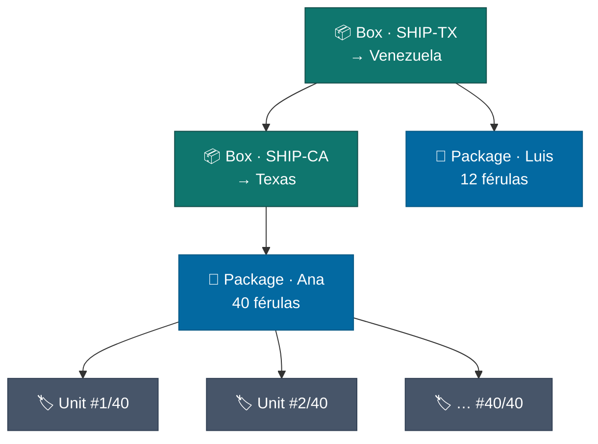
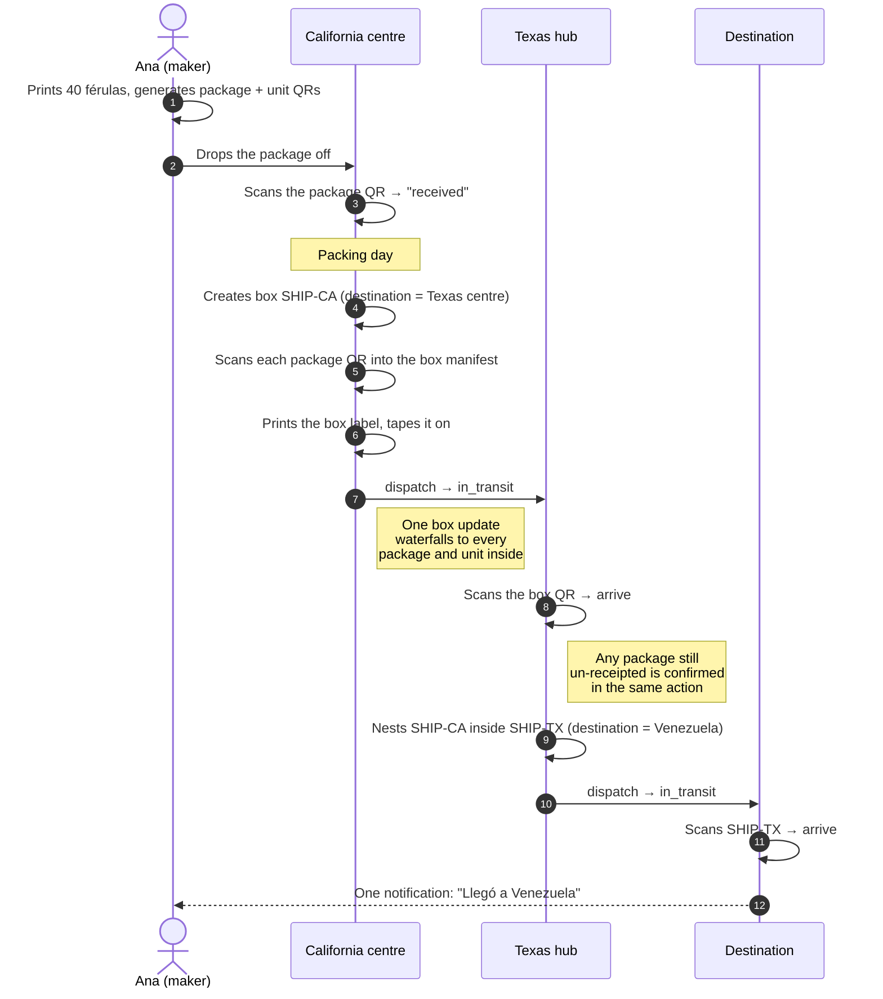
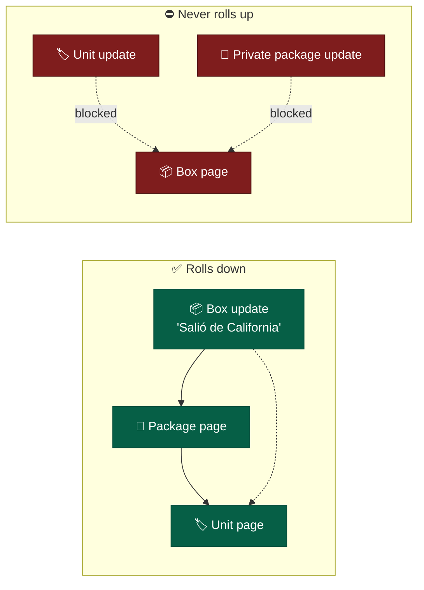
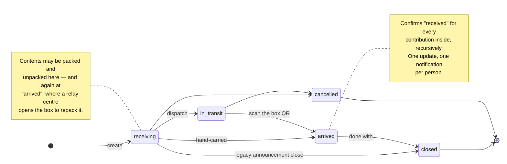
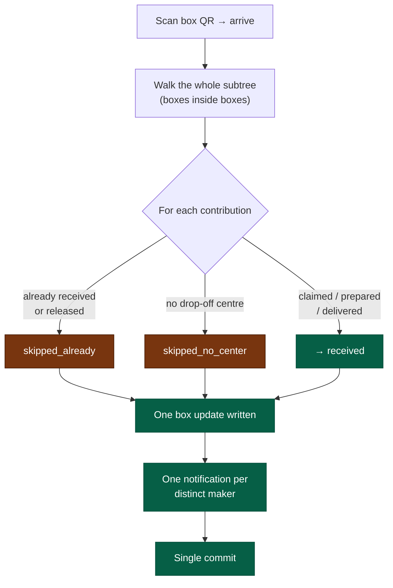

# Logistics & Box Tracking

How a printed splint gets from a maker's desk to the people who need it —
and how one QR taped to a cardboard box keeps everyone informed along the
way.

This page is written for **maintainers and collection-center staff**. It
explains the model, the day-to-day operations, and the rules the platform
enforces so nobody has to guess.

---

## The three QR levels

Everything below rests on one idea: there are **three sizes of thing** a QR
can be stuck to, and each has its own scan page at `/track/{token}`.

| Level | What it is | Who prints it |
|---|---|---|
| **Unit** | One printed piece. A 283-piece contribution has 283 of them, numbered `#1/283` … `#283/283`. | The maker, from their contribution's tracking page |
| **Package** | One maker's whole contribution — all of its units together. | The maker, same sheet |
| **Box** (Shipment) | The physical carton a center packs many packages into. May also contain **other boxes**. | Center staff, from the shipment page |



Two rules keep this graph sane:

- **A package — or a box — sits inside at most one open box at a time.**
  Containment is a tree, never a tangle.
- **Boxes nest at most five levels deep.** Real relay chains are two or
  three (local centre → regional hub → destination).

---

## The journey of one splint

The relay case in full: makers drop off in **California**, California ships
one big box to **Texas**, Texas combines several such boxes into an even
bigger shipment bound for **Venezuela**.



Ana never has to ask where her splints are. Every scan of any box above
them shows up on her package's page — and on each of her 40 unit pages.

---

## The update waterfall

This is the part worth understanding properly.

**Updates flow downward.** Post "left Caracas today" on a box and it
appears on every package inside it, and on every unit inside those
packages, at any nesting depth. One write, hundreds of timelines.

**Nothing flows upward.** A box's own page shows **only** box-level
updates. It never lists what the packages inside have been saying.



**Why the asymmetry?** A box is public — anyone who photographs the label
can read its page. The packages inside are not: a maker may have set theirs
to `private`. Rolling box news *down* leaks nothing, because the package
page is still gated by its own visibility. Rolling package news *up* would
publish a private timeline to whoever picked up the box.

The same rule shapes the **manifest**:

| Viewer | Sees on a box page |
|---|---|
| Anyone (guest included) | Status, dates, destination, route, and totals: "12 paquetes · 3 cajas · 284 piezas" |
| Same, for a non-public package | A redacted line. Counted in `hidden_count`, never named — no resource, no maker, no token, no quantity |
| Staff of the **origin** or **destination** centre, and maintainers/admins | The full itemised manifest, including tokens for reprinting |

Unit counts shown to a viewer only ever sum the packages that viewer can
see, so the total can never be subtracted from anything to recover a hidden
quantity.

---

## Box lifecycle



- **Contents are editable only in `receiving` and `arrived`.** A sealed or
  in-flight box is frozen, so a manifest always describes what physically
  travelled.
- **`closed` predates boxes**, where it meant "dispatched, no longer
  accepting". It is kept, and still reachable straight from `receiving`, so
  the announcement-style shipments centres already use keep working
  untouched. Existing rows were not reinterpreted.
- **Cancelling releases the contents** so the packages inside are free to go
  into the next box rather than being trapped in one that is never leaving.
  The historical manifest survives — unpacking is a soft delete, and
  repacking is an append, so "which box was this in on 3 August?" stays
  answerable.

---

## Who may do what

| Action | Origin-centre staff | Destination-centre staff | Maintainer / admin | Anyone with the token |
|---|---|---|---|---|
| Read the box page | ✅ | ✅ | ✅ | ✅ |
| Read the itemised manifest | ✅ | ✅ | ✅ | ⛔ (totals only) |
| Pack / unpack | ✅ | ✅ | ✅ | ⛔ |
| Dispatch | ✅ | ✅ | ✅ | ⛔ |
| Mark arrived (bulk receive) | ✅ | ✅ | ✅ | ⛔ |
| Post an update | ✅ | ✅ | ✅ | ✅ |

The important row is **mark arrived**. Authorization follows **custody of
the box**, not membership of the centre each contribution was dropped off
at. At a relay hop nobody staffs the maker's original centre — demanding it
would make relay receiving impossible.

Note that a contribution's `collection_center_id` is **never rewritten** by
an arrival. It records where the maker actually dropped off, which is a
different fact from where the box eventually landed.

---

## Bulk receive: what actually happens



Skips are **reported, not fatal**. One package with no drop-off centre must
not roll back the other thirty-seven. The response tells the receiving team
exactly what happened:

```json
{
  "received": 37,
  "skipped_already": 3,
  "skipped_no_center": 1,
  "packages_total": 41
}
```

At a relay hop `skipped_already` is normally the *large* number — the
origin centre receipted everything weeks ago — and that is a healthy
result, not a problem.

`/arrive` fires once; a second call is refused. When something needs
re-running (a package added late, a receipt that failed), use
**`/receive-contents`**, the idempotent twin that receives whatever is still
outstanding without touching the status.

### Notifications

An arrival writes **one** box-level update and sends **one** notification
per affected maker — never one per package, and never one per printed unit.
A box of 300 units belonging to 12 makers produces 12 messages.

---

## Operational runbook

**Packing a box.** Create a shipment on the centre's page. If the next stop
is another centre on the platform, set it as the destination — that is what
makes it a relay hop and lets the receiving team sign for it. Then scan each
package into the manifest. You can scan **any** QR on the thing in your
hand: a unit QR packs the whole package it belongs to, because packages are
what get packed.

**Labelling.** Print the box label and tape it where a phone can reach it.
The QR resolves to the box's public page.

**Dispatching.** Hit dispatch. The manifest freezes, and everyone with
something inside gets told it is on the road.

**Receiving a relay box.** Scan the box QR and mark it arrived. Everything
inside is confirmed in one action. Then either nest the whole box into your
next outbound box, or open it and repack the packages individually — both
are allowed while it sits at `arrived`.

**Reprinting a lost label.** The token never changes, so reprinting the box
label produces the same QR. Unit labels work the same way: growing a
contribution from 283 to 300 needs paper only for units 284–300.

---

## Failure modes

| Situation | What the platform does |
|---|---|
| A package is already in another box | Refused, naming the box holding it, so you know where to go and unpack it |
| You try to nest a box inside itself, or inside something it already contains | Refused as a cycle |
| The chain would exceed five boxes deep | Refused |
| A package arrives that is not on the manifest | Nothing stops you adding it while the box is `receiving` or `arrived` |
| A box is cancelled by mistake | Contents are released; repack them into a new box. The old manifest survives as history |
| A contribution inside has no drop-off centre | Skipped on arrival and reported, so a human can fix it |

---

## Related requirements

FR-137 – FR-149 in [the requirements](../requirements.md#311-collection-center-shipments--box-tracking).
Schema in [the database reference](database-schema.md#shipment-contents);
endpoints in [the API specification](api-specification.md).
