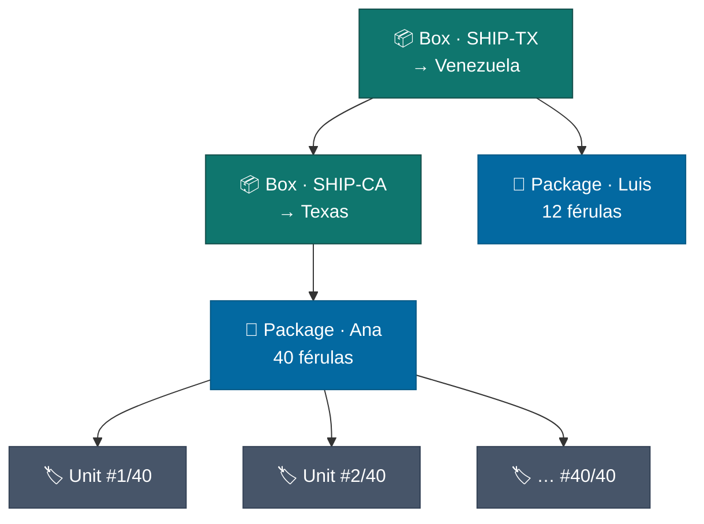
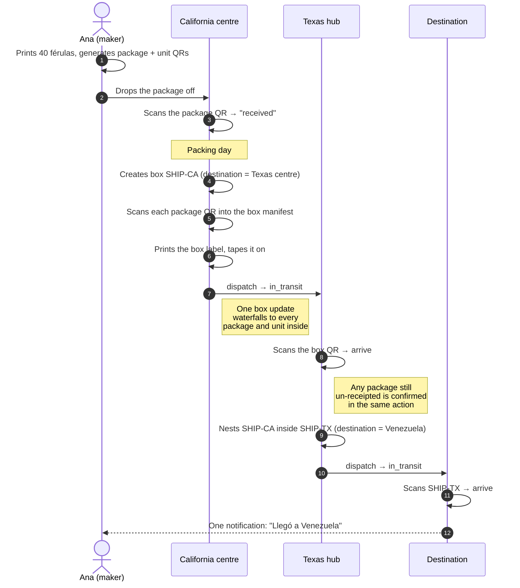
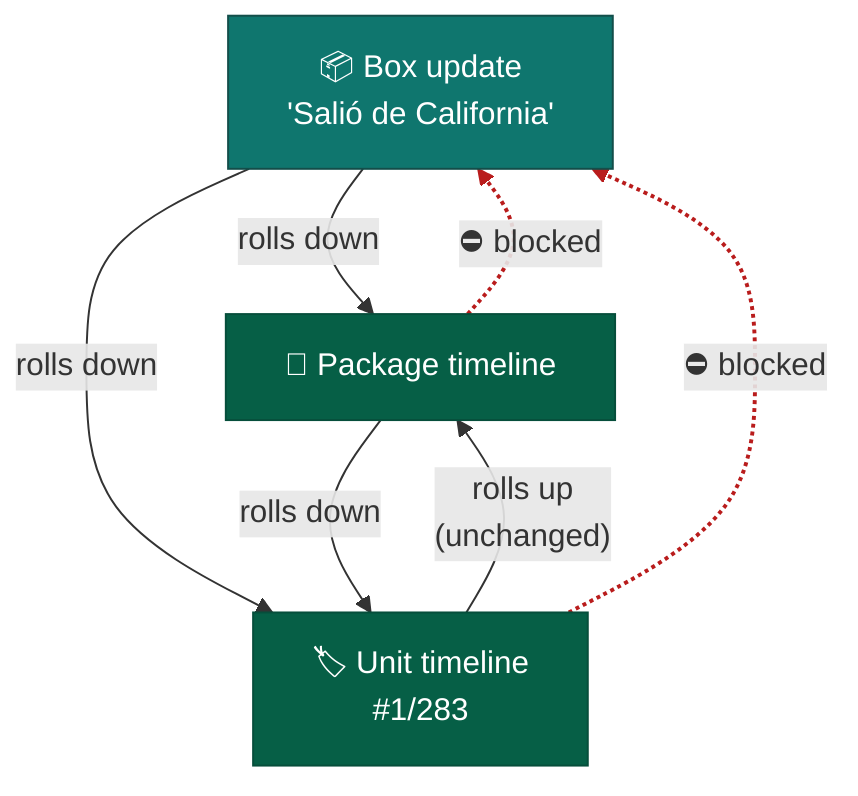
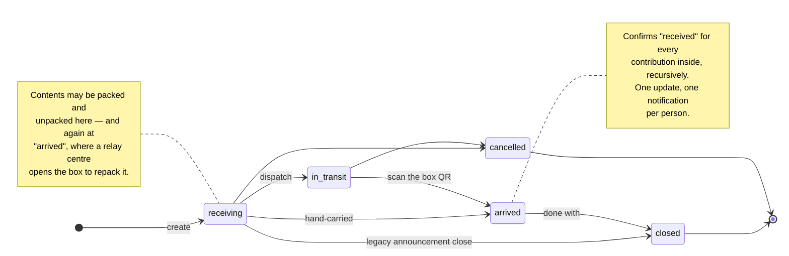
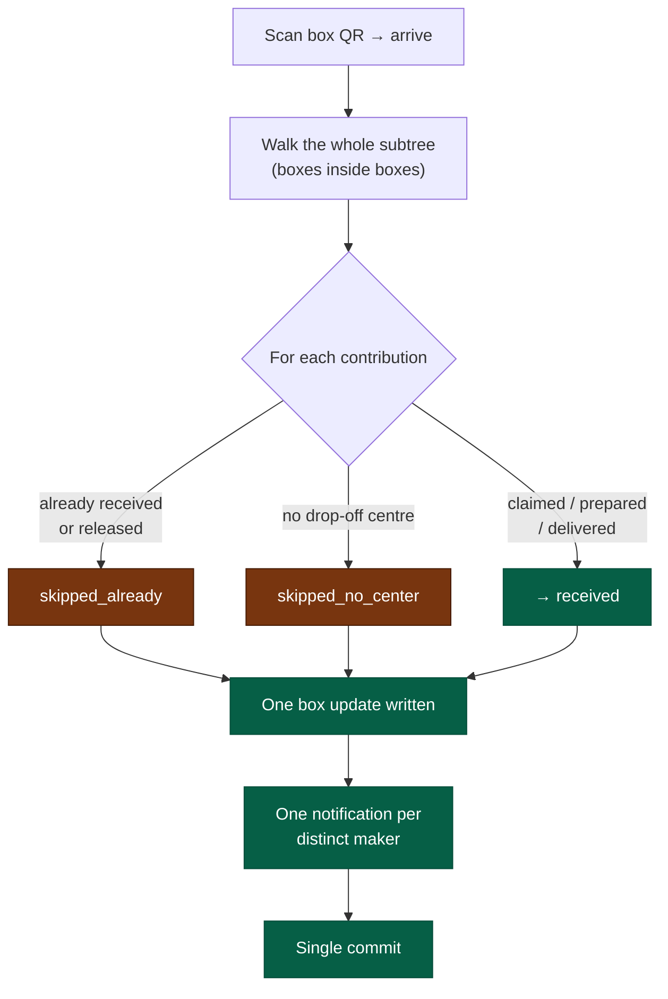

# Logistics & Box Tracking

How a printed splint gets from a maker's desk to the people who need it —
and how one QR taped to a cardboard box keeps everyone informed along the
way.

This page is written for **maintainers and collection-center staff**. It
explains the model, the day-to-day operations, and the rules the platform
enforces so nobody has to guess.

---

## The three QR levels

Everything below rests on one idea: there are **three sizes of thing** a QR
can be stuck to, and each has its own scan page at `/track/{token}`.

| Level | What it is | Who prints it |
|---|---|---|
| **Unit** | One printed piece. A 283-piece contribution has 283 of them, numbered `#1/283` … `#283/283`. | The maker, from their contribution's tracking page |
| **Package** | One maker's whole contribution — all of its units together. | The maker, same sheet |
| **Box** (Shipment) | The physical carton a center packs many packages into. May also contain **other boxes**. | Center staff, from the shipment page |



Two rules keep this graph sane:

- **A package — or a box — sits inside at most one open box at a time.**
  Containment is a tree, never a tangle.
- **Boxes nest at most five levels deep.** Real relay chains are two or
  three (local centre → regional hub → destination).

---

## The journey of one splint

The relay case in full: makers drop off in **California**, California ships
one big box to **Texas**, Texas combines several such boxes into an even
bigger shipment bound for **Venezuela**.



Ana never has to ask where her splints are. Every scan of any box above
them shows up on her package's page — and on each of her 40 unit pages.

---

## The update waterfall

This is the part worth understanding properly.

**Updates flow downward.** Post "left Caracas today" on a box and it
appears on every package inside it, and on every unit inside those
packages, at any nesting depth. One write, hundreds of timelines.

**Unit updates still roll up to their package**, exactly as they always
have. Post something on unit `#1/283` and the maker sees it on their
package timeline, tagged with the unit number. Nothing about that changed.

**The one boundary is the box.** A box's own page shows **only** box-level
updates. It never lists what the packages inside have been saying.



So a package timeline is the fullest view there is: its own updates, its
units' updates rolling up, and every enclosing box's updates rolling down.

**Why is the box the boundary?** A box is public — anyone who photographs
the label can read its page. The packages inside are not: a maker may have
set theirs to `private`. Rolling box news *down* leaks nothing, because the
package page is still gated by its own visibility, and a unit rolling up
into its own package leaks nothing either — same owner, same tier. Rolling
package news *up into the box* is the only hop that would publish a private
timeline to whoever picked up the carton.

The same rule shapes the **manifest**:

| Viewer | Sees on a box page |
|---|---|
| Anyone (guest included) | Status, dates, destination, route, and totals: "12 paquetes · 3 cajas · 284 piezas". No lines. |
| Staff of the **origin** or **destination** centre, and maintainers/admins | The full itemised manifest — quantity, part, maker and status per line, plus tokens for reprinting |

The totals are public because a box's size is printed on its label anyway,
and the community should be able to see that aid is moving. The **lines**
are not, and that is the deliberate part: a label is a physical object
anyone can photograph, and holding one must not turn into a roster of who
sent what — not even for packages that are public one token at a time.

That itemised list is what the receiving centre checks the delivery
against, and it is on the box's scan page as well as its console, so the
team expecting a box can see what is coming before it arrives.

---

## Box lifecycle



- **Contents are editable only in `receiving` and `arrived`.** A sealed or
  in-flight box is frozen, so a manifest always describes what physically
  travelled.
- **`closed` predates boxes**, where it meant "dispatched, no longer
  accepting". It is kept, and still reachable straight from `receiving`, so
  the announcement-style shipments centres already use keep working
  untouched. Existing rows were not reinterpreted.
- **Cancelling releases the contents** so the packages inside are free to go
  into the next box rather than being trapped in one that is never leaving.
  The historical manifest survives — unpacking is a soft delete, and
  repacking is an append, so "which box was this in on 3 August?" stays
  answerable.

---

## Who may do what

| Action | Origin-centre staff | Destination-centre staff | Maintainer / admin | Anyone with the token |
|---|---|---|---|---|
| Read the box page | ✅ | ✅ | ✅ | ✅ |
| Read the itemised manifest | ✅ | ✅ | ✅ | ⛔ (totals only) |
| Pack / unpack | ✅ | ✅ | ✅ | ⛔ |
| Dispatch | ✅ | ✅ | ✅ | ⛔ |
| Mark arrived (bulk receive) | ✅ | ✅ | ✅ | ⛔ |
| Post an update | ✅ | ✅ | ✅ | ✅ |

The important row is **mark arrived**. Authorization follows **custody of
the box**, not membership of the centre each contribution was dropped off
at. At a relay hop nobody staffs the maker's original centre — demanding it
would make relay receiving impossible.

Note that a contribution's `collection_center_id` is **never rewritten** by
an arrival. It records where the maker actually dropped off, which is a
different fact from where the box eventually landed.

---

## Bulk receive: what actually happens



Skips are **reported, not fatal**. One package with no drop-off centre must
not roll back the other thirty-seven. The response tells the receiving team
exactly what happened:

```json
{
  "received": 37,
  "skipped_already": 3,
  "skipped_no_center": 1,
  "packages_total": 41
}
```

At a relay hop `skipped_already` is normally the *large* number — the
origin centre receipted everything weeks ago — and that is a healthy
result, not a problem.

`/arrive` fires once; a second call is refused. When something needs
re-running (a package added late, a receipt that failed), use
**`/receive-contents`**, the idempotent twin that receives whatever is still
outstanding without touching the status.

### Notifications

An arrival writes **one** box-level update and sends **one** notification
per affected maker — never one per package, and never one per printed unit.
A box of 300 units belonging to 12 makers produces 12 messages.

---

## Where do I do what?

Every screen you need, in the order you need it. All paths are relative to
the site root — `https://printforhelp.org/centers/…`.

| I want to… | Go to | Look for |
|---|---|---|
| Create a box | `/centers/{centre}` | **Shipments** section → **Añadir envío** |
| Mark it a relay leg | same form | **Centro de destino** dropdown |
| Open the box console | `/centers/{centre}/shipments/{box}` | **Ver envío →** on the shipment card |
| Put a contribution in | box console | **Contenido de la caja** → paste/scan field |
| …or from the piece itself | scan its QR → `/track/{token}` | **Meter en una caja** → pick the box |
| Nest another box in | box console | same field — paste the other box's QR |
| Take something out | box console | **Sacar** on that line |
| Print the box label | box console | **QR de la caja** → **Imprimir etiqueta (PDF)** |
| Dispatch it | box console | **Despachar** |
| Sign for an arriving box | box console **or** scan its QR | **Marcar como recibida** |
| Re-run a receipt | box console | **Volver a confirmar contenido** |
| See a box's public page | `/track/{box-token}` | (what a scanned QR opens) |

Makers print their own QRs elsewhere — `/my-contributions/{id}/tracking` —
and that is unchanged. Centre staff never need that page.

### 1. Create the box

On the centre's page (`/centers/{centre}`), find the **Shipments** section
and press **Añadir envío**. Fill in the date and, if you like, a free-text
destination.

If the next stop is **another centre on the platform**, pick it in the
**Centro de destino** dropdown. This is the step that makes it a relay leg:
it is what lets the receiving centre's team sign for the box when it lands.
Leave it empty for a final delivery.

New boxes start in `receiving`. Leave the status alone — the transit states
are driven by the buttons on the box console, not by this form.

### 2. Open the box console

Back on the centre page, the new shipment appears as a card. **Ver envío →**
opens `/centers/{centre}/shipments/{box}` — the box console, where
everything below happens.

### 3. Put contributions in

Under **Contenido de la caja** there is a single input: **Pega o escanea el
código QR**.

Scan whatever QR is on the thing in your hand and paste it. All three work:

- a **unit** QR (`#1/283`) — packs the *whole* contribution it belongs to
- a **package** QR — packs that contribution
- another **box's** QR — nests that box whole

A pasted full URL (`https://printforhelp.org/track/xyz`) is fine; that is
what a phone camera gives you. Each line then shows quantity, part, and
maker, with a **Sacar** button to take it back out.

If the platform refuses, the message says why — usually *"Eso ya viaja en
otra caja"*, which names the box currently holding it so you can go and
unpack it there first.

**Or pack from the piece instead.** Scanning a QR with your phone opens
`/track/{token}`, and if you staff a centre that page offers **Meter en una
caja** with your open boxes listed. Pick one, press **Añadir**, scan the
next thing — no need to keep the box console open at all, which is usually
faster when working through a pile one package at a time.

Only centre staff see that panel: a maker or passer-by scanning the very
same QR sees nothing, because they have no box to file anything into. If
the thing is already packed, the panel says which box has it and links
straight there rather than offering to move it.

### 4. Print the label

**QR de la caja** shows the code and two buttons. **Imprimir etiqueta
(PDF)** gives you an A4 sheet: destination, origin, date, a QR big enough to
scan across a loading dock, and — with **Incluir lista de contenido**
ticked — a second page listing everything inside, for the receiving team to
tick off.

Tape it where a phone can reach it. Print it whenever you like: the code
never changes, so a reprint is always the same QR, and you can print before
the box is full.

### 5. Dispatch

Press **Despachar**. The manifest freezes at that moment, and everyone with
something inside is told it is on the road.

### 6. Sign for an arriving box

Either open its console, or just scan the QR on the carton with your phone —
both show **Marcar como recibida**.

That one action confirms receipt for **every** contribution inside,
including those in nested boxes. You will see a summary like
*"37 confirmados · 3 ya recibidos · 1 sin centro"*. The middle number is
normal at a relay hop: the origin centre receipted those weeks ago. The last
number is the one worth chasing — it means a contribution has no drop-off
centre recorded and needs a human.

If a package turns up late and you add it after arrival, press **Volver a
confirmar contenido** to receipt just the stragglers. (Pressing **Marcar
como recibida** twice is refused on purpose.)

### 7. Repack for the next leg

An arrived box is open again, so you can either nest it whole into your next
outbound box, or take the packages out individually and pack them into a new
one. Both are done from the same **Contenido de la caja** panel.

### Everyday problems

**"I lost the label."** Reprint it from the box console — same QR.

**"A contribution is in the wrong box."** Open the box holding it, press
**Sacar**, then add it to the right one. The old manifest is kept as
history; nothing is erased.

**"We cancelled a shipment."** Edit it to `cancelled`. Everything inside is
released automatically, so you can pack it into the next box straight away.

**"Something arrived that isn't on the list."** Add it — a box in
`receiving` or `arrived` still accepts contents.

---

## Failure modes

| Situation | What the platform does |
|---|---|
| A package is already in another box | Refused, naming the box holding it, so you know where to go and unpack it |
| You try to nest a box inside itself, or inside something it already contains | Refused as a cycle |
| The chain would exceed five boxes deep | Refused |
| A package arrives that is not on the manifest | Nothing stops you adding it while the box is `receiving` or `arrived` |
| A box is cancelled by mistake | Contents are released; repack them into a new box. The old manifest survives as history |
| A contribution inside has no drop-off centre | Skipped on arrival and reported, so a human can fix it |

---

## Related requirements

FR-137 – FR-149 in [the requirements](../requirements.md#311-collection-center-shipments--box-tracking).
Schema in [the database reference](database-schema.md#shipment-contents);
endpoints in [the API specification](api-specification.md).
