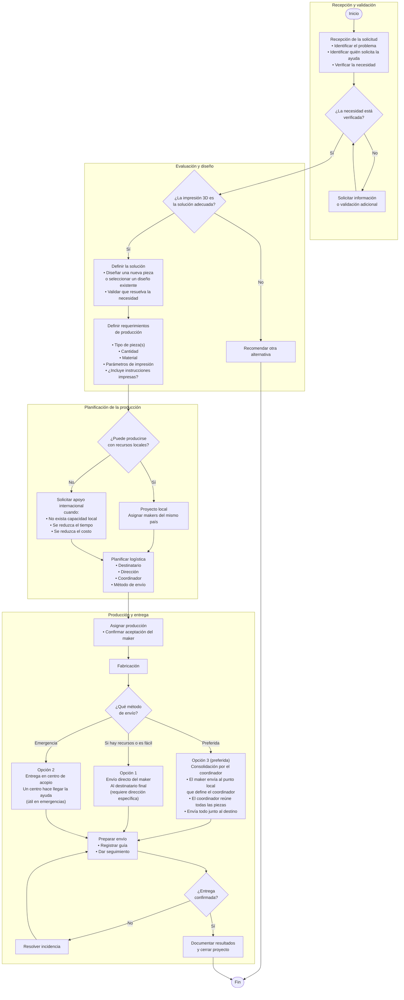

# Flujo de trabajo para solicitudes de impresión 3D

## Inicio

### 1. Recepción de la solicitud

- Recibir la solicitud.
- Identificar:
  - ¿Qué problema se busca resolver?
  - ¿Quién solicita la ayuda?
  - ¿La necesidad ya fue verificada?

*Decisión:* ¿La necesidad está verificada?

- *No*
  - Solicitar información o validación adicional.
  - Esperar validación.
  - Regresar a la verificación.
- *Sí*
  - Continuar al siguiente paso.

---

### 2. Evaluar la viabilidad de impresión 3D

*Decisión:* ¿La impresión 3D es una solución adecuada?

- *No*
  - Buscar otra alternativa.
  - Cerrar la solicitud.
- *Sí*
  - Continuar.

---

### 3. Definir la solución

- Diseñar una nueva pieza *o*
- Seleccionar un diseño existente.
- Validar que la solución cumpla con la necesidad.

---

### 4. Definir los requerimientos de producción

Especificar:

- Tipo de pieza(s).
- Cantidad requerida.
- Material recomendado.
- Parámetros de impresión.
- ¿Requiere guía o instrucciones impresas?

---

### 5. Definir el alcance del proyecto

*Decisión:* ¿La producción puede realizarse con recursos locales?

#### Sí → Proyecto local

- La producción se asigna a makers del mismo país.
- La distribución se realiza localmente.

#### No → Solicitar apoyo internacional

El coordinador solicita apoyo a la comunidad internacional cuando:

- La capacidad de producción local es insuficiente.
- Fabricar en otro país reduce el tiempo de entrega.
- Fabricar en otro país reduce los costos.

---

### 6. Planificar la logística

Definir:

- Destinatario final.
- Dirección de entrega.
- Coordinador responsable.
- Método de envío.

---

### 7. Producción

- Asignar la fabricación.
- Confirmar la aceptación del trabajo por parte del maker.
- Dar seguimiento al proceso de fabricación.

---

### 8. Envío

*Decisión:* ¿Qué método de envío se usará?

Existen tres opciones. La **opción 3 es la preferida**; las
otras dos se usan cuando conviene por recursos, facilidad o urgencia.

#### Opción 3 (preferida) → Consolidación por el coordinador

- El maker envía las piezas al punto o dirección local que define el
  coordinador.
- El coordinador reúne todas las contribuciones.
- El coordinador envía todo junto al destino final.

#### Opción 1 → Envío directo del maker

- El maker envía su contribución directamente a la persona o lugar que
  la necesita (requiere la dirección específica del destinatario).
- Se usa cuando el contribuidor tiene los recursos o es fácil enviar
  directo.

#### Opción 2 → Entrega en centro de acopio

- El maker deja las piezas en un centro de acopio o lugar que puede
  hacer llegar la ayuda.
- Se usa en casos de emergencia, cuando hay un centro que puede
  entregar la ayuda con rapidez.

En cualquiera de las opciones:

- Preparar el envío.
- Registrar la información de seguimiento.
- Monitorear el transporte.

---

### 9. Confirmación de entrega

*Decisión:* ¿La entrega fue exitosa?

#### Sí

- Confirmar recepción con el destinatario.
- Documentar el resultado.
- Cerrar el proyecto.

#### No

- Identificar la incidencia.
- Definir acciones correctivas.
- Dar seguimiento hasta completar la entrega.

---

## Diagrama (Mermaid)

